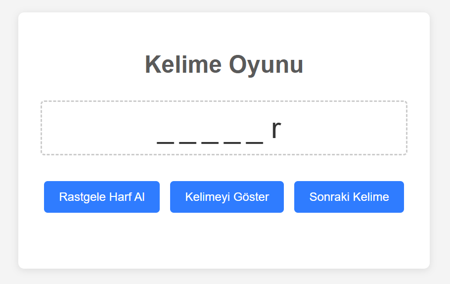
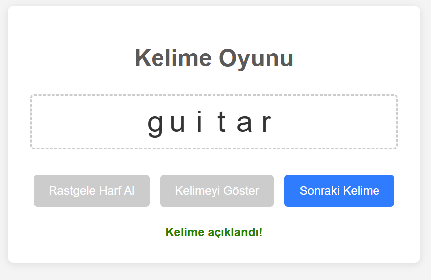

# Word Guesser (Local) Web App

A simple web application for a word guessing game. The game presents words one at a time, displaying blank slots for each letter. Players can reveal letters randomly or reveal the entire word. Runs locally.

<div style="display: grid; grid-template-columns: auto auto;">
  
  
</div>

## Features

*   **Dynamic Word Loading**: Words are fetched from an external Turkish dictionary source at runtime.
*   **Categorized Words**: The game aims to select a specific number of words from different length categories (3 to 10 letters).
*   **Letter Slots Display**: Shows `_ _ _` for hidden letters.
*   **Reveal Random Letter**: A button to randomly uncover one of the hidden letters.
*   **Reveal Word**: A button to show the entire current word.
*   **Next Word**: A button to move to the next word in the pre-selected list.
*   **Session-Based Game State**: Remembers the current word and its revealed state for the user's session.

## Project Structure
```word_guesser/
├── app.py # Main Flask application (backend logic)
├── word_selector.py # Module to fetch and select words
├── static/
│ ├── style.css # CSS for styling the frontend
│ └── script.js # JavaScript for frontend interactivity
└── templates/
│ └──  index.html # Main HTML page template
└── README.md
```

## Technical Stack

*   **Backend**: Python, Flask
*   **Frontend**: HTML, CSS, JavaScript
*   **Word Source**: [TDKDictionaryCrawler Word List](https://github.com/ncarkaci/TDKDictionaryCrawler/blob/master/TDK_S%C3%B6zl%C3%BCk_Kelime_Listesi.txt) (fetched via HTTP GET request)
*   **Libraries**:
    *   `Flask`: Web framework for Python.
    *   `requests`: For making HTTP requests to fetch the word list.

## Setup and Installation

1.  **Clone the Repository (if applicable)**:
    ```bash
    git clone dkelesch/word_guesser 
    cd word_guesser
    ```
    If you just have the files, create a directory (e.g., `word_guesser`) and place all project files inside it based on the directory structure above.

2.  **Create a Virtual Environment (Recommended)**:
    ```bash
    python -m venv venv
    ```
    Activate the virtual environment:
    *   On Windows:
        ```bash
        venv\Scripts\activate
        ```
    *   On macOS/Linux:
        ```bash
        source venv/bin/activate
        ```

3.  **Install Dependencies**:
    Make sure you have Python 3.6+ installed.
    ```bash
    pip install Flask requests
    ```

## How to Run

1.  Navigate to the project's root directory (`word_guesser/`) in your terminal.
2.  Ensure your virtual environment is activated.
3.  i. If playing in Turkish, first run word_selector.py in your terminal. The word_selector will attempt to download and process the word list from the specified URL. You'll see messages in the console indicating its progress. Then, update the `WORDS_BY_LENGHT` parameter in app.py.
    
    ii. If playing in another language or if you want to set up your words manually, you can directly update the `WORDS_BY_LENGHT` parameter in app.py.
4.  Run the Flask application:
    ```bash
    python app.py
    ```
5.  Open your web browser and go to: `http://127.0.0.1:5000/`


## How to Play

1.  The game will start with the first word displayed as blank slots.
2.  **Rastgele Harf Al/Reveal a Random Letter**: Click this button to randomly show one of the letters in its correct position.
3.  **Kelimeyi Göster/Reveal Word**: Click this button to show all letters of the current word.
4.  **Sonraki Kelime/Next Word**: Click this button to move to a new word. The game will cycle through the pre-selected 56 words.

## Word Selection Logic (`word_selector.py`)

*   The `word_selector.py` module is responsible for fetching a list of Turkish words from an external URL.
*   It cleans and filters these words, keeping only those with Turkish alphabet characters.
*   It then attempts to randomly select 7 words for each length category from 3 to 10 letters (totaling 56 words).
*   If a category doesn't have enough words, it will take all available words for that category and issue a warning in the console.
*   This selected list is then used by the main `app.py` for the game.

## Customization

*   **Word Source**: To change the source of words, modify the `WORD_LIST_URL` constant in `word_selector.py`. Or directly update `WORDS_BY_LENGHT` parameter in app.py.
*   **Number of Words/Lengths**:
    *   Adjust `TARGET_LENGTHS` and `WORDS_PER_LENGTH` in `word_selector.py` to change the word selection criteria.
*   **Styling**: Modify `static/style.css` to change the appearance.
*   **Fallback Words**: If `word_selector.py` fails to fetch or process words, `app.py` has a very basic hardcoded fallback. You can improve this fallback list in `app.py`.

## Potential Future Enhancements

*   User input for guessing letters/words.
*   Scoring system.
*   Timer.
*   Word list intake in UI for moderators.
*   More robust error handling and UI feedback.
*   Saving game progress or high scores (would require a database).

---

*Author: [Deniz/dkelesch]*
*Date: May 2025*
